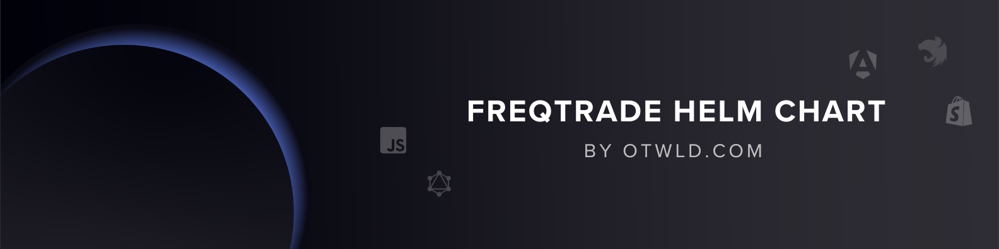

# Freqtrade Helm Chart


[](https://artifacthub.io/packages/helm/ollama-helm/ollama)
[](https://github.com/otwld/freqtrade-helm-chart/actions/workflows/ci.yaml)
[](https://discord.gg/U24mpqTynB)

Production-grade Helm chart for running Freqtrade dashboards and multi-bot fleets on Kubernetes.

## Highlights

- Fleet-oriented design built around `dashboard` and `bots[]`
- Isolated StatefulSet, ConfigMap, Secret, PVC, Service, and optional Ingress per bot
- Shared analysis dashboard with optional companion data jobs for graphing
- Strategy delivery via image, PVC, or `initSync`
- Bots default to `initial_state: running` so dry-run and live bots start trading immediately unless you override that behavior
- Bot-level Telegram support aligned with the official Freqtrade configuration model
- Render-time validation for common Freqtrade configuration mistakes

## Quick Start

```bash
helm lint .
./scripts/generate-docs.sh
./scripts/lint-examples.sh .

helm upgrade --install freqtrade . \
  --namespace freqtrade \
  --create-namespace \
  -f examples/minimal.yaml
```

## Documentation

- The repo is the source of truth for the handbook and is structured so it can be copied directly into a GitHub wiki.
- [Wiki Home](docs/Home.md)
- [Architecture](docs/Architecture.md)
- [Installation and Upgrades](docs/Installation-and-Upgrades.md)
- [Examples](docs/Examples.md)
- [Operations](docs/Operations.md)
- [Releases and CI](docs/Releases-and-CI.md)
- [Troubleshooting](docs/Troubleshooting.md)

To export the handbook into a checked-out GitHub wiki repository:

```bash
./scripts/export-wiki.sh /path/to/freqtrade-helm-chart.wiki
```

## Values Model

Top-level values are intentionally small:

- `global`: shared defaults
- `dashboard`: optional shared webserver instance
- `bots`: list of independent bot instances

## Examples

- [`examples/minimal.yaml`](examples/minimal.yaml)
- [`examples/bot-with-telegram.yaml`](examples/bot-with-telegram.yaml)
- [`examples/dashboard-and-bots.yaml`](examples/dashboard-and-bots.yaml)
- [`examples/private-bot-ui.yaml`](examples/private-bot-ui.yaml)
- [`examples/public-dashboard.yaml`](examples/public-dashboard.yaml)
- [`examples/external-secret.yaml`](examples/external-secret.yaml)
- [`examples/existing-pvc.yaml`](examples/existing-pvc.yaml)
- [`examples/strategy-init-sync.yaml`](examples/strategy-init-sync.yaml)
- [`examples/values-freqtrade-v2.yaml`](examples/values-freqtrade-v2.yaml)

## Release Workflow

- `./scripts/generate-docs.sh` refreshes `README.md` from `README.md.gotmpl` and `values.yaml`
- `./scripts/lint-examples.sh .` validates the chart and every shipped example
- `.github/workflows/ci.yaml` enforces docs freshness and packages the chart on every PR and `main` push
- `.github/workflows/release-readiness.yaml` validates tagged builds and uploads the packaged chart artifact

## Telegram

Telegram is configured per bot through `bots[].telegram`.

- Required when enabled: `token`, `chatId`
- Optional upstream-aligned fields: `topicId`, `authorizedUsers`, `allowCustomMessages`, `reload`, `balanceDustLevel`, `notificationSettings`, `keyboard`
- Keep Telegram secrets in secure values handling; the chart renders them as a separate secret-backed config overlay

Reference:

- [Bot with Telegram example](examples/bot-with-telegram.yaml)
- https://www.freqtrade.io/en/stable/telegram-usage/
- https://www.freqtrade.io/en/stable/configuration/

## Values

This reference is generated from `values.yaml` with `helm-docs`.

Notes:

- `bots` is an array of bot definitions. Since the default is `[]`, use [Examples](docs/Examples.md) and the inline comments in `values.yaml` for the per-bot instance shape.
- `dashboard` and `global` defaults are documented directly below.

| Key | Type | Default | Description |
|-----|------|---------|-------------|
| bots | list | `[]` |  |
| dashboard.affinity | object | `{}` |  |
| dashboard.api.corsOrigins | list | `[]` |  |
| dashboard.api.enabled | bool | `true` |  |
| dashboard.api.port | int | `8080` |  |
| dashboard.args | list | `[]` |  |
| dashboard.command | list | `[]` |  |
| dashboard.config.existingSecret | string | `""` |  |
| dashboard.config.existingSecretKey | string | `"config-private.json"` |  |
| dashboard.config.externalSecret.data | list | `[]` |  |
| dashboard.config.externalSecret.dataFrom | list | `[]` |  |
| dashboard.config.externalSecret.enabled | bool | `false` |  |
| dashboard.config.externalSecret.refreshInterval | string | `"1h"` |  |
| dashboard.config.externalSecret.secretStoreRef.kind | string | `"ClusterSecretStore"` |  |
| dashboard.config.externalSecret.secretStoreRef.name | string | `""` |  |
| dashboard.config.externalSecret.target.creationPolicy | string | `"Owner"` |  |
| dashboard.config.externalSecret.target.name | string | `""` |  |
| dashboard.config.public | object | `{}` |  |
| dashboard.config.secret | object | `{}` |  |
| dashboard.containerSecurityContext | object | `{}` |  |
| dashboard.dataJobs.downloadData.activeDeadlineSeconds | string | `nil` |  |
| dashboard.dataJobs.downloadData.backoffLimit | int | `1` |  |
| dashboard.dataJobs.downloadData.days | int | `14` |  |
| dashboard.dataJobs.downloadData.enabled | bool | `false` |  |
| dashboard.dataJobs.downloadData.erase | bool | `false` |  |
| dashboard.dataJobs.downloadData.extraArgs | list | `[]` |  |
| dashboard.dataJobs.downloadData.failedJobsHistoryLimit | int | `1` |  |
| dashboard.dataJobs.downloadData.pairs | list | `[]` |  |
| dashboard.dataJobs.downloadData.resources.limits | object | `{}` |  |
| dashboard.dataJobs.downloadData.resources.requests.cpu | string | `"100m"` |  |
| dashboard.dataJobs.downloadData.resources.requests.memory | string | `"256Mi"` |  |
| dashboard.dataJobs.downloadData.schedule | string | `""` |  |
| dashboard.dataJobs.downloadData.successfulJobsHistoryLimit | int | `1` |  |
| dashboard.dataJobs.downloadData.timeframes[0] | string | `"15m"` |  |
| dashboard.dataJobs.downloadData.ttlSecondsAfterFinished | int | `86400` |  |
| dashboard.dataJobs.enabled | bool | `false` |  |
| dashboard.enabled | bool | `false` |  |
| dashboard.env | list | `[]` |  |
| dashboard.envFrom | list | `[]` |  |
| dashboard.extraArgs | list | `[]` |  |
| dashboard.extraContainers | list | `[]` |  |
| dashboard.extraVolumeMounts | list | `[]` |  |
| dashboard.extraVolumes | list | `[]` |  |
| dashboard.image | object | `{}` |  |
| dashboard.ingress.annotations | object | `{}` |  |
| dashboard.ingress.className | string | `""` |  |
| dashboard.ingress.enabled | bool | `false` |  |
| dashboard.ingress.host | string | `""` |  |
| dashboard.ingress.path | string | `"/"` |  |
| dashboard.ingress.pathType | string | `"Prefix"` |  |
| dashboard.ingress.tls | list | `[]` |  |
| dashboard.initContainers | list | `[]` |  |
| dashboard.lifecycle | object | `{}` |  |
| dashboard.networkPolicy | object | `{}` |  |
| dashboard.nodeSelector | object | `{}` |  |
| dashboard.persistence.accessModes[0] | string | `"ReadWriteOnce"` |  |
| dashboard.persistence.annotations | object | `{}` |  |
| dashboard.persistence.enabled | bool | `true` |  |
| dashboard.persistence.existingClaim | string | `""` |  |
| dashboard.persistence.mountPath | string | `"/freqtrade/user_data"` |  |
| dashboard.persistence.size | string | `"20Gi"` |  |
| dashboard.persistence.storageClassName | string | `""` |  |
| dashboard.podAnnotations | object | `{}` |  |
| dashboard.podLabels | object | `{}` |  |
| dashboard.podSecurityContext | object | `{}` |  |
| dashboard.priorityClassName | string | `""` |  |
| dashboard.probes | object | `{}` |  |
| dashboard.resources | object | `{}` |  |
| dashboard.service.annotations | object | `{}` |  |
| dashboard.service.type | string | `"ClusterIP"` |  |
| dashboard.terminationGracePeriodSeconds | string | `nil` |  |
| dashboard.tolerations | list | `[]` |  |
| dashboard.topologySpreadConstraints | list | `[]` |  |
| dashboard.ui.enabled | bool | `true` |  |
| global.affinity | object | `{}` |  |
| global.containerSecurityContext.allowPrivilegeEscalation | bool | `false` |  |
| global.containerSecurityContext.capabilities.drop[0] | string | `"ALL"` |  |
| global.containerSecurityContext.runAsGroup | int | `1000` |  |
| global.containerSecurityContext.runAsNonRoot | bool | `true` |  |
| global.containerSecurityContext.runAsUser | int | `1000` |  |
| global.containerSecurityContext.seccompProfile.type | string | `"RuntimeDefault"` |  |
| global.env | list | `[]` |  |
| global.envFrom | list | `[]` |  |
| global.extraContainers | list | `[]` |  |
| global.extraVolumeMounts | list | `[]` |  |
| global.extraVolumes | list | `[]` |  |
| global.fullnameOverride | string | `""` |  |
| global.image.pullPolicy | string | `"IfNotPresent"` |  |
| global.image.pullSecrets | list | `[]` |  |
| global.image.repository | string | `"freqtradeorg/freqtrade"` |  |
| global.image.tag | string | `"stable"` |  |
| global.initContainers | list | `[]` |  |
| global.lifecycle | object | `{}` |  |
| global.nameOverride | string | `""` |  |
| global.networkPolicy.egress.allowDns | bool | `true` |  |
| global.networkPolicy.egress.rules | list | `[]` |  |
| global.networkPolicy.enabled | bool | `false` |  |
| global.networkPolicy.ingress.from | list | `[]` |  |
| global.nodeSelector | object | `{}` |  |
| global.podAnnotations | object | `{}` |  |
| global.podLabels | object | `{}` |  |
| global.podSecurityContext.fsGroup | int | `1000` |  |
| global.podSecurityContext.fsGroupChangePolicy | string | `"OnRootMismatch"` |  |
| global.priorityClassName | string | `""` |  |
| global.probes.liveness.enabled | bool | `true` |  |
| global.probes.liveness.failureThreshold | int | `6` |  |
| global.probes.liveness.initialDelaySeconds | int | `30` |  |
| global.probes.liveness.periodSeconds | int | `15` |  |
| global.probes.liveness.timeoutSeconds | int | `5` |  |
| global.probes.readiness.enabled | bool | `true` |  |
| global.probes.readiness.failureThreshold | int | `6` |  |
| global.probes.readiness.initialDelaySeconds | int | `5` |  |
| global.probes.readiness.periodSeconds | int | `10` |  |
| global.probes.readiness.successThreshold | int | `1` |  |
| global.probes.readiness.timeoutSeconds | int | `5` |  |
| global.probes.startup.enabled | bool | `true` |  |
| global.probes.startup.failureThreshold | int | `30` |  |
| global.probes.startup.initialDelaySeconds | int | `10` |  |
| global.probes.startup.periodSeconds | int | `10` |  |
| global.probes.startup.timeoutSeconds | int | `5` |  |
| global.resources.limits | object | `{}` |  |
| global.resources.requests.cpu | string | `"250m"` |  |
| global.resources.requests.memory | string | `"512Mi"` |  |
| global.serviceAccount.annotations | object | `{}` |  |
| global.serviceAccount.automountToken | bool | `false` |  |
| global.serviceAccount.create | bool | `false` |  |
| global.serviceAccount.name | string | `""` |  |
| global.terminationGracePeriodSeconds | int | `60` |  |
| global.tolerations | list | `[]` |  |
| global.topologySpreadConstraints | list | `[]` |  |

## Source Code

* <https://github.com/otwld/freqtrade-helm-chart>
* <https://github.com/freqtrade/freqtrade>

## Core team

<table>
    <tr>
       <td align="center">
            <a href="https://github.com/ntrehout"
                ><br /><b>&nbsp;&nbsp;&nbsp;&nbsp;&nbsp;Nathan&nbsp;Tréhout&nbsp;&nbsp;&nbsp;&nbsp;&nbsp;</b></a
            >
            <div style="margin-top: 4px">
                <a href="https://x.com/n_trehout" title="Twitter"
                    ></a>
                <a href="https://github.com/ntrehout" title="Github"
                    ></a>
                <a
                    href="mailto:ntrehout@otwld.com"
                    title="Email"
                    ></a>
            </div>
        </td>
       <td align="center">
            <a href="https://github.com/jdetroyes"
                ><br /><b>&nbsp;&nbsp;&nbsp;&nbsp;&nbsp;Jean Baptiste&nbsp;Detroyes&nbsp;&nbsp;&nbsp;&nbsp;&nbsp;</b></a
            >
            <div style="margin-top: 4px">
                <a href="https://github.com/jdetroyes" title="Github"
                    ></a>
                <a
                    href="mailto:jdetroyes@otwld.com"
                    title="Email"
                    ></a>
            </div>
        </td>
    </tr>
</table>

## Support

- For questions, suggestions, and discussion about Ollama please refer to
  the [Ollama issue page](https://github.com/ollama/ollama/issues)
- For questions, suggestions, and discussion about this chart please
  visit [Ollama-Helm issue page](https://github.com/otwld/ollama-helm/issues) or join
  our [OTWLD Discord](https://discord.gg/U24mpqTynB)
